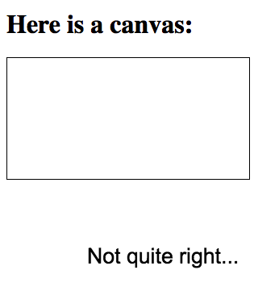
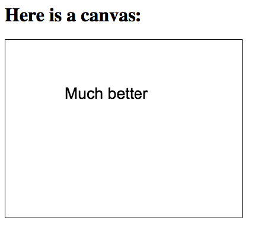

# Usacase

This driver is meant to assist in cases where you cannot properly hook up all of your drivers in your application's [run function](https://cycle.js.org/getting-started.html#getting-started-coding).
A very simple example is the case where your application's UI is managed by Cycle's DOM driver and contains a canvas which the users will interact
with in fascinating ways. What if you wanted to attach a [canvas driver](https://github.com/cyclejs-community/cycle-canvas) to that canvas?
You might try something like this:

```javascript
import {run} from '@cycle/run';
import xs from 'xstream';
import {canvas, div, h1, makeDOMDriver} from '@cycle/dom';
import {text, makeCanvasDriver} from 'cycle-canvas';

function main({DOM, canvasDriver}) {
  const dom$ = xs.of(
    div([
      h1('Here is a canvas:'),
      canvas('#target', {style: {border: "1px solid black"}})
    ])
  );

  const canvas$ = xs.of(
    text({
      x: 100,
      y: 100,
      value: 'Not quite right...',
      font: '20pt Arial'
    })
  );

  return {
    DOM: dom$,
    canvasDriver: canvas$
  };
}

run (main, {
  DOM: makeDOMDriver('#app'),
  canvasDriver: makeCanvasDriver('canvas#target', {width: 500, height: 500})
});
```

What you'd end up with is this:



So what's going on here? When we created the canvas driver and attached it to `canvas#target`, the desired canvas simply did not exist yet (it will exist almost immediately afterwards, once the DOM driver acts on `dom$`). What the canvas driver does in this case is create its own canvas and place it at the end of the document.

## Example

Let us see how we can use the delayed driver to solve the problem we've just described. Here's a revised version of the previous example. This time, we're utilizing the delayed driver to create the canvas driver as a response to the canvas element's creation:

```javascript
import {run} from '@cycle/run';
import xs from 'xstream';
import xsConcat from 'xstream/extra/concat';
import xsDelay from 'xstream/extra/delay';
import {canvas, div, h1, makeDOMDriver} from '@cycle/dom';
import {text, makeCanvasDriver} from 'cycle-canvas';
import {makeDelayedDriver} from 'cycle-delayed-driver';

function canvasDriverOnTarget(elements) {
  if (Array.isArray(elements) && elements.some(e => e.id == 'target')) {
    return makeCanvasDriver('canvas#target', {width: 400, height: 300});
  }
  return null;
}

function main({DOM, delayedCanvas}) {
  const dom$ = xs.of(
    div([
      h1('Here is a canvas:'),
      canvas('#target', {style: {border: "1px solid black"}})
    ])
  );
  
  const targetCanvas$ = DOM.select('canvas#target').elements().endWhen(delayedCanvas.driverCreatedSteam());
  
  const canvas$ = xs.of(text({
    x: 100,
    y: 100,
    value: 'Much better',
    font: '20pt Arial'
  })).compose(xsDelay(0));

  return {
    DOM: dom$,
    delayedCanvas: xsConcat(targetCanvas$, canvas$)
  };
}

run (main, {
  DOM: makeDOMDriver('#app'),
  delayedCanvas: makeDelayedDriver(canvasDriverOnTarget)
});
```

Before we figure out just what is going on here, have a look at the end result:



Now for some explanations. First, you'll notice that in our run function we no longer create the canvas driver directly, but instead do this:

```javascript
delayedCanvas: makeDelayedDriver(canvasDriverOnTarget)
```

This creates a delayed driver that will pass every value it receives through its sink to `canvasDriverOnTarget`. This function, in turn, creates a canvas driver attached to a canvas with the id "target" when it sees such an element has been created.

Once the inner driver is created, the delayed driver forwards its sink to the inner driver, allowing the canvas to render the text "Much better".

One last thing that's worth looking into is the exact nature of the stream we feed the delayed driver - `xsConcat(targetCanvas$, canvas$)`. What this stream does is supply values from the DOM driver's element creation stream until the inner driver is created, at which point it starts supplying values that serve as rendering instructions for the canvas. How is this achieved? Let us examine each of the two streams in the concatination:

- `targetCanvas$`: In essence, this is merely an element creation stream from the DOM driver that specifically looks for the creation of canvas elements with an ID of "target" - `DOM.select('canvas#target').elements()`. Such a stream is endless, so we make it end once the delayed driver sends out a value indicating that its inner driver was created `...endWhen(delayedCanvas.driverCreatedSteam())`.
- `canvas$`: The only odd thing about this stream is that we delay it using `...compose(xsDelay(0))`. This is necessary so that the newly created canvas driver doesn't miss the event supplied by this stream immediately as `targetCanvas$` ends.